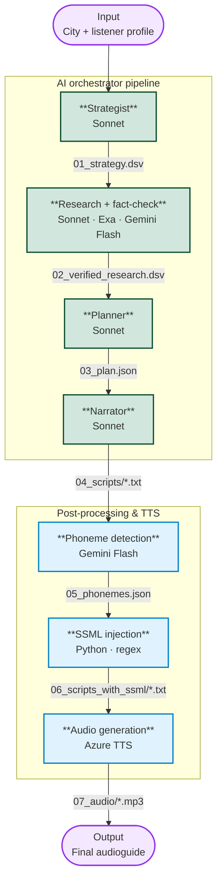
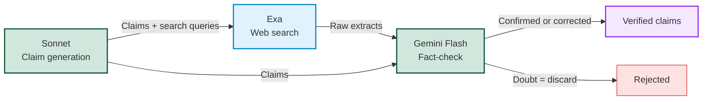

# AI Audioguide Generator — Multi-Agent Pipeline

AIdioguide is a multi-agent pipeline designed to generate immersive historical audio guides that sound flawless. It combines contextual research, scriptwriting (tailored for spoken delivery), and precision phonetic processing to ensure that finicky TTS engines (such as Azure) pronounce foreign names, exonyms and historical anomalies correctly.

Tech Stack: Python 3.10+, Anthropic (Claude Sonnet 4.6 / Gemini Flash 3.0), Exa, Azure TTS (Neural Multilingual), SSML.

**[Listen to an example here: Florence Grand Format (8 min)](#)**

---

## Why not summarize Wikipedia?

A good audioguide doesn't recite facts. It starts from something you can see right now, explains why it matters, and uses it as a doorway into a larger story. Standing in front of the Conciergerie, you don't need dates — you need to understand why Philippe IV destroyed the Knights Templar from the very building in front of you.

The problem: ask an LLM directly for precise architectural details and anecdotes and it hallucinates. Confidently. Early tests showed ~80% hallucination rate on specific claims — the gargoyle that "represents medieval medicine", the inscription that "dates from the original construction". The narration sounded great. Google Maps showed a 
1960s apartment building.

Grounding the narration in verifiable facts without losing the narrative thread requires a pipeline that separates concerns: 
**research and fact-checking first, storytelling second.**
That's what this system is.

## Quickstart & CLI

The orchestrator is designed to be driven via a Command Line Interface (CLI) for easy batch processing.

```bash
# Clone the repository
git clone [https://github.com/your-username/audioguide-ai.git](https://github.com/your-username/audioguide-ai.git)
cd audioguide-ai

# Install dependencies (Python 3.10+)
pip install -r requirements.txt

# Environment variables setup (.env)
# Required keys: ANTHROPIC_API_KEY, GEMINI_API_KEY, EXA_API_KEY, AZURE_TTS_KEY

# Run a full generation pipeline
python main.py generate --city "Paris" --lang "en" --comment "Very good knowledge of the city. Focus on medieval Paris, ignore anything later than the 16th century". --name "my-first-audioguide"
```

## Architecture & Workflow



## Technical Decisions

### Reliability over completeness — the fact-checking layer

The core design decision of this pipeline: **it is acceptable to lose facts. It is not acceptable to invent them.**

A tourist standing in front of a monument will never know that the audioguide omitted an anecdote. They will remember if it told them something wrong.

#### The verification workflow

The research pipeline separates claim generation from claim validation across two distinct models.



**Sonnet** generates two things simultaneously: the claims themselves, and the Exa search queries designed to verify them. This forces the model to anticipate what evidence would confirm or contradict each claim.

**Exa** runs the queries and returns raw source extracts — up to 5 sources per query, 1000 characters each.

**Gemini Flash** receives both the claims and the raw extracts. Its only job: does the evidence support this claim? If it has any doubt, it discards. It cannot introduce new facts, correct based on its own training knowledge, or hedge. The extracts are the only admissible evidence.

This separation is intentional. Sonnet is better at generating rich, narratively interesting claims. Gemini Flash is faster and cheaper on structured verification tasks. 
Using the same model for both generation and verification would create a closed loop with no external grounding.

The verification workflow can be used at two distinct moments: after the strategy phase and after the planification phase if more elements are needed.

#### What this costs

On a complex city like Beirut — fragmented sources across French, English and Arabic — the pipeline produces ~130 verified, usable facts. The audioguide uses fewer than half of them.

~40% of claims are rejected outright. An additional ~20% are corrected before passing.

That's the acceptable loss. The 60 facts that make it through are factually auditable end-to-end.

#### What this prevents

Early versions without this layer produced confident, well-narrated 
hallucinations at ~80% rate on specific architectural details and 
anecdotes. The narration sounded great. The facts were invented.

The pipeline trades completeness for auditability. Every claim in the 
final audio can be traced back to a verified source.

#### Three research modes

The pipeline distinguishes three types of research topics, each handled by a dedicated prompt:

- **Lieu** — forensic research on a specific monument or physical location. Looks for architectural anomalies, physical traces, scars. The claim must point to something the listener can see right now.

- **Thème** — broader thematic research on the city. Power structures, epidemics, social dynamics. Looks for traces in the urban fabric rather than a single building.

- **Deep Dive** — targeted research commissioned by the Planner during Phase 2. Macro context, economic mechanisms, political decisions. No physical proof required — these feed the narrative openings.

These are not parametric variants of the same prompt. The output schema, the confidence scoring, and the verification criteria differ fundamentally between modes — a forensic claim requires a physical proof field, a Deep Dive claim does not.

### DSV over JSON — token economics

The research phase is the most expensive part of the pipeline — 20 LLM calls for a city like medieval Paris, each carrying significant context.

JSON structure is expensive. Quotes, brackets, colons, key names repeated on every row — all tokens that carry zero semantic value for the model. Switching to pipe-separated values eliminates that overhead entirely.

To further reduce the token usage, LLM are instructed to use a telegraphic style, suppressing articles, pronouns, conjugated verbs. Symbols replace prose: `->` for consequence, `@` for location, `~` for approximation. Every tokens represents an idea. 

```
P|Bouchers vs Cabochiens 1413|Bouchers Paris -> acteurs majeurs révolte cabochienne [1413]. Simon Caboche = écorcheur Grande Boucherie -> alliance armée avec faction bourguignonne contre Couronne [3].|Aucun vestige physique direct. Trace @ Archives nationales (registres du Parlement de Paris).|H|révolte cabochienne 1413 bouchers Paris Simon Caboche;;cabochiens ordonnance cabochienne 1413 sources primaires

F|Cimetière Innocents Contiguïté|Grande Boucherie -> déchets organiques / sang -> déversement direct vers Saints-Innocents [2]. Contamination hydrique documentée. Stratigraphie archéologique = couches graisseuses identifiées [4].|Fouilles archéologiques @ Square des Innocents. Ossuaire transféré Catacombes [1786].|H|cimetière Saints-Innocents Paris archéologie médiévale contamination;;fouilles INRAP Saints-Innocents stratigraphie
```


Combined, both decisions deliver a ~3x token reduction on research outputs versus natural language JSON.

**In practice — medieval Paris (20 calls)**

| Step | Model | Input | Output |
|------|-------|-------|--------|
| Claim generation ×20 | Sonnet | ~4 000 tokens | ~1 500 tokens |
| Fact-check ×20 | Gemini Flash | ~30–40 000 tokens | ~3 000 tokens |

The fact-check input is large by design — raw Exa extracts are verbose. Thought tokens on Flash were reduced from ~25 000 to ~2 500 by relaxing formatting constraints — the model spends its reasoning budget on verification, not on layout.

### Translating user intent — the Strategist layer

The Strategist converts the user profile into a strict `ANGLE_RECHERCHE` directive that constrains every downstream agent.

For the same Istanbul city, "I know nothing, I'm with my kids" and "Byzantine expert, no Ottoman mosques, only pre-1453" don't just produce different content — they require fundamentally different research pipelines. Locking the angle upstream prevents each agent from reinterpreting the profile independently.

The directive is strict by design. If a research agent finds a compelling fact that falls outside the angle, it is discarded — not because it isn't interesting, but because coherence across 15 stops matters more than any single fact.

### The Planner — geographic logic and the guillotine rule

The Planner is the most editorially powerful agent in the pipeline. 
It receives the Strategist's initial stop list and the full validated 
fact corpus — and rewrites both.

**Geographic reordering.** Stops are reorganized by adjacent zones — 
the itinerary must make sense on foot. A thematically coherent but 
geographically absurd sequence is restructured before narration begins. 
Every stop gets a precise street address to prevent the listener from 
ending up at the wrong building.

**Hard suppression of ungrounded stops.** Any stop with no validated 
facts is deleted without mercy. No facts = no stop, regardless of how 
interesting the location seemed during planning.

**Editorial freedom.** The Planner can add stops the Strategist never 
planned — "breathing stops" in front of disappeared or anonymous 
elements, used to deliver broader historical context between two major 
sites. It can also designate one stop as Grand Format (~8 minutes), 
requiring the listener to sit down and listen.

**Narrative thread declaration.** Before narration begins, the Planner 
explicitly maps recurring figures and themes across the itinerary — 
where each thread is introduced, developed, and closed:
```json
{
  "theme": "Le Pouvoir Contre la Ville : De Marcel à Charles V",
  "introduit_au": 6,
  "developpe_aux": [8, 9],
  "clos_au": 16,
  "resume": "La Grève comme base du contre-pouvoir marchand..."
}
```

Without this, the same historical figure surfaces independently at 
multiple stops with no coherence between them. On an early version of 
the medieval Paris audioguide, Étienne Marcel appeared three times — 
each stop treating him as if the listener had never heard of him.

The Narrator receives these threads as part of its context at every stop. 
It knows that Marcel is introduced at stop 6, developed at 8 and 9, and 
closed at 16 — and writes accordingly. 

### Sequential narration in a parallel pipeline

Every other step in the pipeline runs in parallel. Narration is deliberately sequential.

The reason is empirical. Early tests ran narration in parallel — significantly faster, noticeably worse. Nearly every stop opened with a variation of "Look at this..." The model, lacking context about what had already been said, defaulted to the same rhetorical patterns independently at each stop.

Passing the full conversation history of previous stops to each narration call solves the problem. The model can see what openings, sentence structures and transitions have already been used and avoids repeating them. The result is narration that feels like a single voice across 15 stops, not 15 independent texts that happen to be about the same city.

The tradeoff is speed. Sequential narration is the only non-parallelizable step in the pipeline — and intentionally so.

### Phoneme handling and SSML injection

A travel audioguide is multilingual by nature. A stop about medieval Paris will mention "Philippe Auguste", "Gemmayzeh" in Beirut, or Ottoman street names in Istanbul — each requiring a different pronunciation strategy.

Gemini Flash detects three categories of terms and generates the appropriate handling for each:

- **SSML-supported languages** — a `<lang>` tag switches the TTS engine to the correct phonetic model for that language.
- **Unsupported languages** — IPA phonemes are injected directly, bypassing the TTS engine's language model entirely.
- **Native anomalies** — proper nouns and historical names that a TTS engine reliably mispronounces in their own language(Roman numerals, archaic spellings) also get IPA phonemes.

The injection itself is deterministic Python — regex replacements applied to the narration script before it reaches Azure TTS. A structured text transformation doesn't need a model.

If Azure returns error 1007 (invalid phoneme), the pipeline automatically retries without phonemes, falling back to `<lang>` tags only. The listener gets slightly degraded pronunciation rather than no audio.

### Multi-model routing — right model for the right task

Each model is chosen for a specific task, not used uniformly:

**Sonnet 4.6** handles everything requiring reasoning, narrative judgment, or editorial decisions — claim generation, planning, narration. Temperature is tuned per task: strategy at 1.0 (the Planner acts as a downstream correction layer), planning at 0.6 (structural precision matters), narration at 0.8 (voice and stylistic variation matter).

**Gemini Flash 3.0** handles structured verification and phoneme detection. Faster and cheaper on deterministic tasks. Per Google's recommendation for Gemini 3.0, temperature is left at default — the model's internal calibration is more reliable than manual tuning on this generation.

Using a single model for the entire pipeline would mean either overpaying for verification tasks or under-powering narration. The routing reflects the actual cost/performance profile of each step.


## Stack

Python · asyncio · Pydantic · Loguru · Claude Sonnet 4.6 · Gemini Flash 3.0 · Exa · Azure Speech Studio

## Exploring the examples

The `examples/` folder contains the complete pipeline output for three 
audioguides — every intermediate artifact, from raw research to final audio.

---

### Paris médiéval (French) — `examples/paris_medieval_fr/`

**Recommended reading path**

**Start at the very beginning — the Strategist's output:**
- `01_strategy.dsv`  
  The research directive and stop list that launched the entire pipeline.  
  Compare it against `03_plan.json` to see what the Planner kept, 
  reorganized, added, and killed.

**Then — the fact-checker in action:**
- `02_Research/phase_1/cimetière_des_innocents_.../02.1_unverified_research.dsv`  
  vs `02.3_verified_research.dsv`  
  15 claims in, 6 out. ~60% rejection rate on a well-documented subject.
  Every rejected claim had insufficient or contradictory Exa evidence.

**Then — the Planner's editorial work:**
- `03_plan.json`  
  13 stops, 3 narrative threads, 1 Grand Format (stop 2 — Sainte-Chapelle, 
  8 minutes). Compare against `01_strategy.dsv` to see what the Planner 
  kept, added, and killed.

**Then — narration to audio:**
- `04_Scripts/2.txt` → `06_Scripts_with_SSML/2.txt`  
  The Sainte-Chapelle Grand Format script before and after SSML injection.  
  Note: medieval Paris is a near-monolingual corpus — SSML phoneme 
  injection is minimal here. See the Angkor example for a more 
  representative case (Khmer proper nouns, Sanskrit terms, multilingual 
  sources).

**Finally — the audio:**
- `07_Audio/2.mp3` — Sainte-Chapelle, 8 minutes  
- `07_Audio/11.mp3` — Square des Innocents, 4 minutes  

**Full structure**
```
examples/paris_medieval_fr/
├── 01_strategy.dsv
├── 02_Research/
│   ├── phase_1/          ← 13 subjects, each with raw + verified DSV
│   └── phase_2/          ← 2 deep dives commissioned by the Planner
├── 03_plan.json
├── 04_Scripts/           ← narration scripts + conversation history
├── 05_phonemes.json
├── 06_Scripts_with_SSML/ ← scripts with injected SSML tags
└── 07_Audio/             ← 13 MP3 files
```

---

### Angkor (French) — `examples/angkor_fr/`

- `02_Research/phase_1/porte_sud_dangkor_thom.../02.1_unverified_research.dsv`  
  vs `02.3_verified_research.dsv`  
  The fact-checker on a subject with sources across French, English, 
  Khmer and Chinese — including a Zhou Daguan 1296 eyewitness account.

- `04_Scripts/9.txt` → `06_Scripts_with_SSML/9.txt`  
  The most phoneme-dense stop in the corpus: Preah Khan, with Khmer 
  proper nouns (`Preah Khan`, `Jayavarman VII`, `Lokesvara`, `Bayon`, 
  `khñum vraḥ`) and Sanskrit terms handled by IPA injection. Compare 
  the plain script with the SSML version to see the phoneme layer in 
  action.

- `07_Audio/9.mp3` — Preah Khan, phoneme showcase (3 min)

---

### Florence (English) — `examples/florence_en/`

- `04_Scripts/1.txt` → `06_Scripts_with_SSML/1.txt`  
  Stop 1 — Piazza della Repubblica. The plain English narration vs the 
  SSML version with `<lang xml:lang='it-IT'>` tags switching the TTS 
  engine mid-sentence for Italian proper nouns and a full inscription 
  read aloud in Italian. A different phoneme strategy than Angkor: 
  language switching rather than IPA injection.

- `07_Audio/1.mp3` — Piazza della Repubblica, language switching showcase (3 min)

## Known Limitations & Tech Debt

This is a functional prototype, not a production system. Here's what doesn't scale and what would need to change.

### Functional Limitations
* **One-shot generation:** The pipeline runs start to finish with no interaction. There's no way to review the Strategist's output, amend the Planner's stop list, or iterate on the narration before audio generation. A production version would need a human-in-the-loop review between phases.
* **Audio-only output:** The pipeline produces narration scripts and MP3 files, but not a deployable audioguide. A production front-end would additionally need geographic coordinates, stop descriptions, cover images, and structured metadata per stop — none of which are currently generated.
* **Fixed voice and TTS provider:** Azure Speech Studio with Vivienne DragonHD is hardcoded. Voice selection, TTS provider switching, and language-to-voice routing would need to be configurable.
* **Time to first audio (15–20 minutes):** The sequential narration step is the bottleneck — 13 stops written one after another. The architecture currently waits for all narration to complete before starting phoneme detection and audio generation. 
  * *The fix:* A streaming architecture. Stream each narration stop as it's written, run phoneme detection inline, and push to TTS via WebSocket. Estimated time to first audio under this model: under 5 minutes. Not implemented.

### Technical Limitations
* **No tests:** The DSV parser, Pydantic validation logic, and phoneme injection are untested. The system is validated empirically across multiple cities (with 10–20 research calls per audioguide), but there are zero unit or integration tests.
* **Naive Rate Limiting & Scale:** Claude is protected by basic exponential backoff (`tenacity`) for 429 errors, but Gemini relies on raw API calls. The system is idempotent by design (a failed run can be resumed from the last saved checkpoint), but at a larger scale, this in-memory async architecture would melt. A true production system would require a robust message broker to manage API queues.
